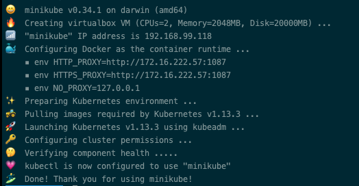

### 安装minikube吃过的屎

## 由于GFW墙了Google镜像, Minikube在start过程中新建一个虚拟机，在虚拟机中创建一个单节点的K8s集群,需要让docker翻墙下载镜像,一般有几种解决方案

### 最新安装方式
1. minikube start --docker-env HTTP_PROXY=${HTTP_PROXY} --docker-env HTTPS_PROXY=${HTTPS_PROXY} --docker-env NO_PROXY=localhost

### 备注:参考资料
1. minikube start --help
2. [https://kubernetes.io/docs/setup/minikube/#using-minikube-with-an-http-proxy](https://kubernetes.io/docs/setup/minikube/#using-minikube-with-an-http-proxy)

1. 使用阿里云编译的minikube,修改了成了国内镜像[https://yq.aliyun.com/articles/221687](https://yq.aliyun.com/articles/221687)
2. 在虚拟机中手动下载对应的版本的镜像在阿里云中的镜像，然后打上gcr.io的域名标签 [https://github.com/chunchill/minikube-startup-china](https://github.com/chunchill/minikube-startup-china)
3. 修改docker engineer的proxy [https://docs.docker.com/config/daemon/systemd/](https://docs.docker.com/config/daemon/systemd/)

## 总结

1. minikube ssh 登录kube虚拟机
2. 阿里编译的镜像v0.33, 版本非最新
3. 手动下载对应的阿里云的镜像, 需要自己手动修改对应的版本,没有到执行的哪一步，不知道是哪个Version
4. 直接修改proxy 重启服务 重启docker 最快

