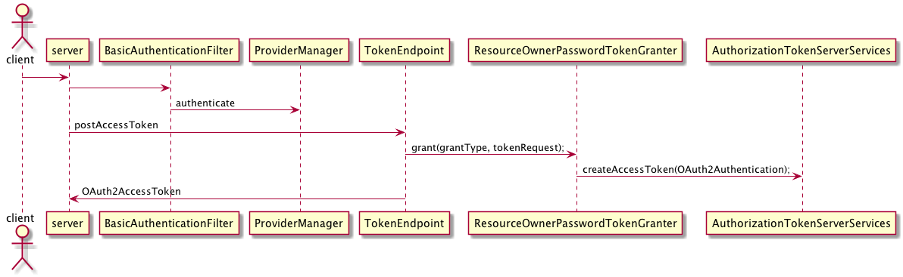
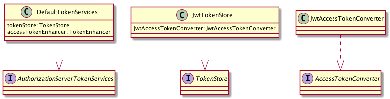
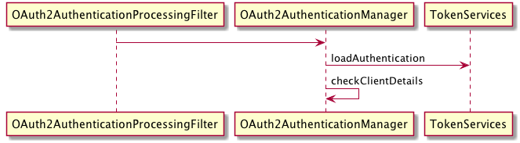
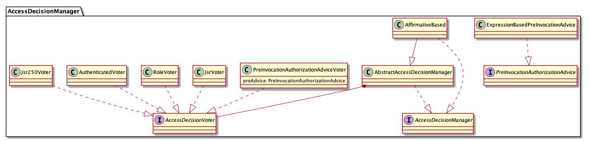
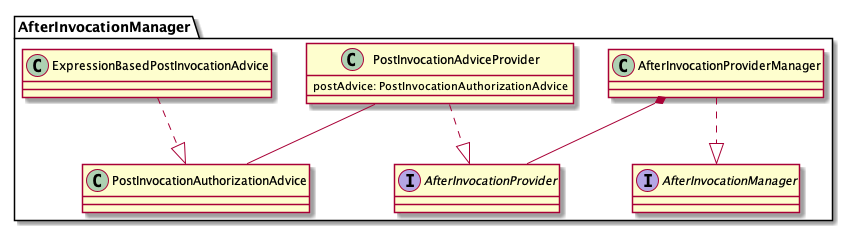
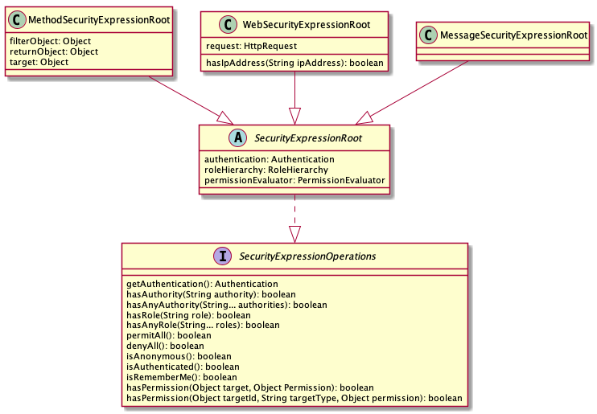
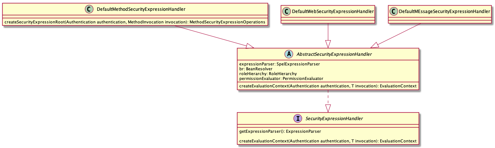
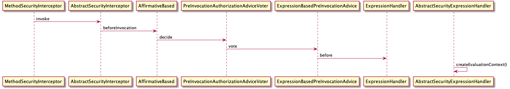

# Spring Security OAuth2 Annalyze
----

## 认证流程


1. 通过BasicAuthenticationFilter过滤器, 从Header("Authorization")中获取username和password(即oauth2 clientId, password),通过ProviderManager对clientId和password进行认证
2. ProviderManager是AuthenticationManager的实现，包含一系列的AuthenticationProvider，迭代使用providers进行认证，返回认证结果
3. DaoAuthenticationProvider.java是AuthenticationProvider一个实现，用来判断用户名和密码是否正确，获取对应的真实用户名和密码的由UserDetailsService负责，UserDetailsService在Client认证过程中，就是ClientDetailsService
4. 客户端认证完毕后,运行到TokenEndPoint.java中 postAccessToken 方法中
5. 根据传过来的grant_type来判断使用哪个TokenGranter来生成token,以ResourceOwner为例，在ResourceOwnerTokenGranter.java中执行资源用户密码信息的认证，认证完成之后，根据认证信息使用AuthorizationTokenServerServices来创建accessToken
6. 创建完token之后返回给client


## JWT 生成流程


1. DefaultTokenServices是AuthorizationServerTokenServices的实现，AuthorizationServerTokenServices主要负责token的创建，刷新
2. TokenStore主要负责token的存储和获取,实现由JdbcTokenStore, RedisTokenStore, JwtTokenStore, InMemoryTokenStore, JwkTokenStore
3. DefaultTokenServices 使用JwtAccessTokenConverter.enhance来对token进行增强，改写为jwt格式
4. JwtTokenStore 使用JwtAccessTokenConverter.decode来对jwtToken进行解密


## 资源认证


1. 资源服务器通过@EnableResourceServer来生成一个OAuth2AuthenticationProcessingFilter来将Authorization头中的值转换为上下文的SecurityContext
2. OAuth2AuthenticationManager 通过TokenStore来将Token转换为认证上下文,TokenServices.loadAuthentication(token);

## 方法级安全认证


1. spring security method 方法级注解具体使用的类
2. AffirmativeBased 只要有一个通过就成立
3. ConsensusBased 投票成立
4. UnanimousBased 全部通过才成立

```
## 动态角色
## id 为组织id 用户拥有某个组织的TAKE的权限, 例如ROLE_TAKE_1
## 执行时,根据获取数据的id，拼接成对应的权限,判断用户是否有这个权限
@PreAuthorize(value = "hasRole('ROLE_TAKE_'.concat(#id))")
  public GalleryGto get(@RequestParam Long id) {
```

#### security spel uml class diagram



### expression handler


### security interceptor sequence diagram

